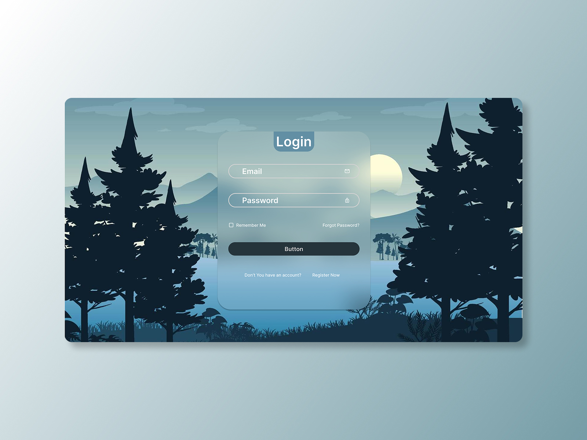
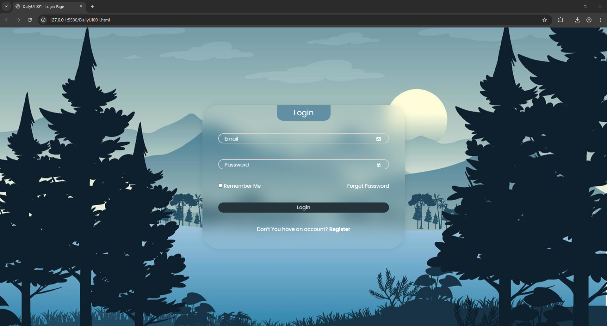

 # Challenge 001 – Login Page 🔐

## 🎯 Goal
Design and code a modern, user-friendly login page interface.

## 🛠️ What I Did
This challenge was completed using:
- **HTML** (`dailyui001.html`)
- **CSS** (`assets/style.css`)
- **Icons** sourced directly from [Boxicons](https://boxicons.com/) via CDN

The layout is responsive and focuses on clarity, accessibility, and visual balance.

## 📸 Screenshots

### ✏️ UI Design (Concept)

### 💻 Final Coded Output

<!--
## 🚀 Live Preview
Live demo link will be added soon.
-->

---

## 🗂️ Folder Structure

- **Daily-UI-Challenges/**
  - `001-Login-Page/`
    - `dailyui001.html`
    - `assets/`
        - `img/`
        - `style.css`
    - `Screenshots/`
    - `README.md`
---

## 📌 Notes
- Live preview will be published once deployment setup is complete.
- This is part of my Daily UI challenge series to sharpen my front-end development and UI design skills.
