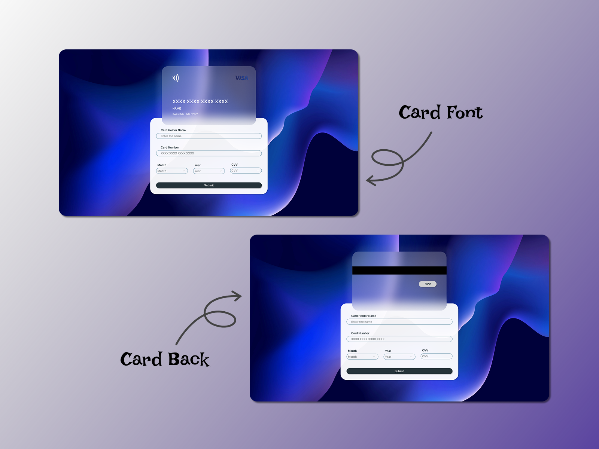
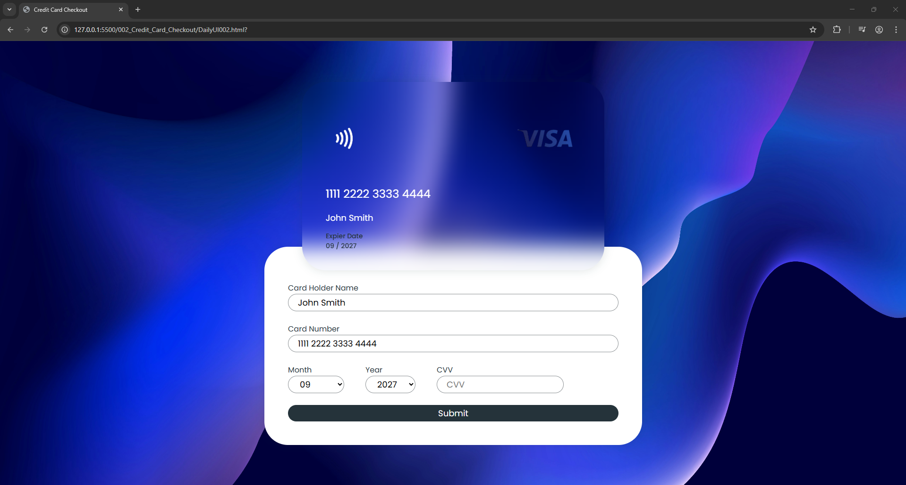

# Challenge 002 – Credit Card Checkout 💳

## 🎯 Goal
Design and build a visually engaging and interactive credit card checkout form that mimics a real-world payment experience.

## 🛠️ What I Did
This challenge was implemented using:
- **HTML** (`DailyUI002.html`)
- **CSS** (`assets/css/style.css`)
- **Inline JavaScript** for real-time interaction and validation
- Custom 3D card flip animation using CSS and JS

The layout is responsive and simulates a dynamic credit card interface with front and back views that flip when focusing on the CVV field.

## 📸 Screenshots

### ✏️ UI Design (Concept)

### 💻 Final Coded Output

<!--
## 🚀 Live Preview
Live demo link will be added once deployed.
-->

---

## 🗂️ Folder Structure

- **002_Credit_Card_Checkout/**
  - `DailyUI002.html`
  - `assets/`
    - `css/`
      - `style.css`
    - `img/`
      - `img01.png`
      - `img02.png`
      - `bg.jpg`
  - `Screenshots/`
    - `screenshot-design.jpg`
    - `screenshot-coded.png`
  - `README.md`

---

## 📌 Notes
- Card number fields accept only numeric input.
- Invalid card number shows an error below the input.
- Card flips to the back when CVV is focused.
- Live preview will be published once deployment is set up.

---