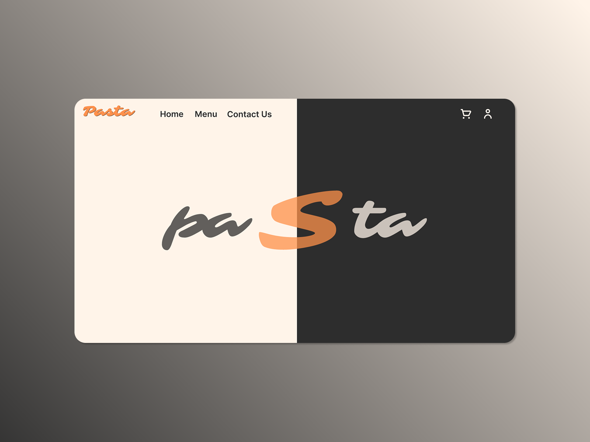
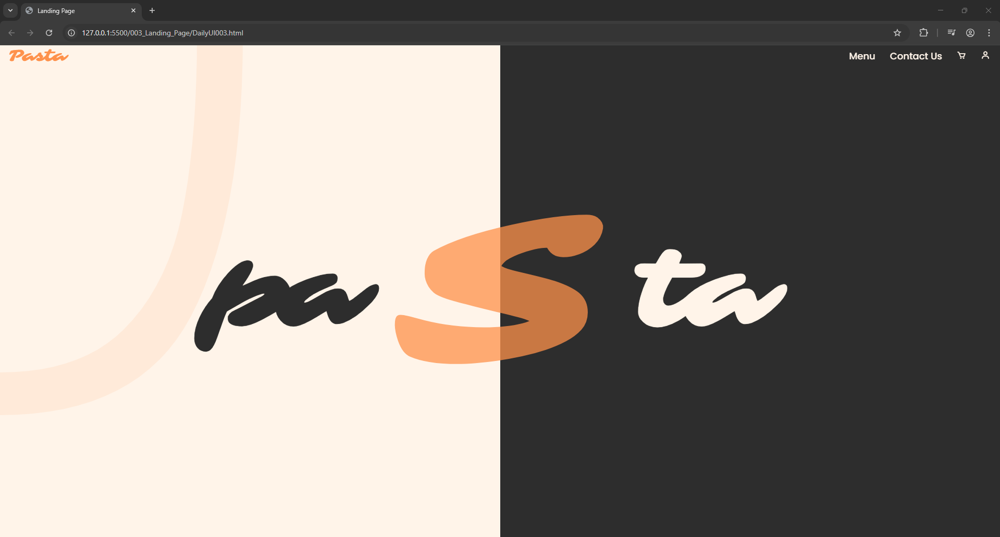

# Challenge 003 – Landing Page 🧑‍🍳

## 🎯 Goal  
Design and build a visually creative landing page centered around a brand ("Pasta") using modern UI elements, animations, and responsive layout.

## 🛠️ What I Did  
This challenge was implemented using:
- **HTML** (`DailyUI003.html`)
- **CSS** (`assets/css/style.css`)
- **JavaScript** with **ScrollReveal.js** for scroll animations
- Custom layout with a central “S” letter reveal and split text heading

Key highlights:
- Scroll-based animation on page elements using `ScrollReveal()`
- Background effects using `body::before` and `body::after`
- Responsive layout and icon-based navigation using Boxicons
- Beautiful typography using **Poppins** and **Sarina** from Google Fonts

## 📸 Screenshots

### ✏️ UI Design (Concept)  

### 💻 Final Coded Output  

<!--
## 🚀 Live Preview  
Live demo link will be added once deployed.
-->

---

## 🗂️ Folder Structure

- **003_Landing_Page/**
  - `DailyUI003.html`
  - `assets/`
    - `css/`
      - `style.css`
  - `Screenshots/`
    - `screenshot-design.png`
    - `screenshot-coded.png`
  - `README.md`

---

## 📌 Notes  
- Scroll animations are triggered as elements enter the viewport.
- The central "S" letter provides visual branding and focal point.
- `ScrollReveal.js` is loaded via CDN from [https://unpkg.com](https://unpkg.com/scrollreveal).
- All text and UI elements are styled with clean, scalable fonts and animations.

---
